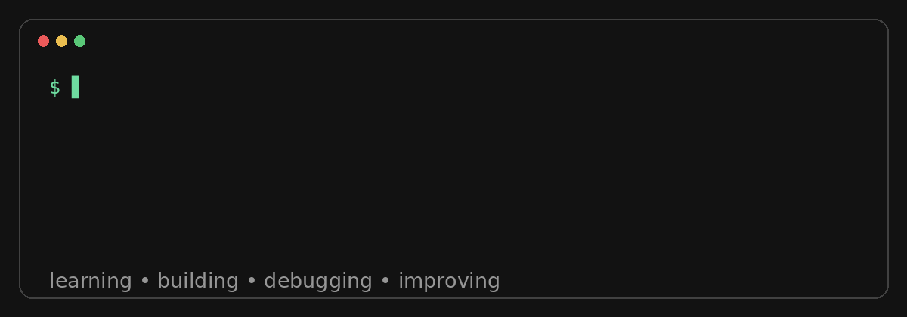

<div align="center">



# Hooman Mosadegh

### Software Developer · Full-Stack Developer in Progress · Coffee Lover ☕

[](https://github.com/houmanmosadegh)
[](mailto:houmanmosaddegh.dev@gmail.com)
[](https://t.me/sudo_holirex)
[](https://www.instagram.com/holirex)

</div>

---

## 👋 Hey, I'm Hooman

I'm a **Software Developer in progress**, currently learning and growing toward **Full-Stack Development**.

I like taking an idea, breaking it down, turning it into code, and seeing it become a real product.

I'm not trying to look like I know everything.

**I'm here to learn, build, break things, fix them, and get better.**

☕ Coffee helps.

---

## 🚀 What I'm Learning

<table>
<tr>
<td width="50%">

### Backend
- 🐍 Python
- ⚡ FastAPI
- 🐘 PostgreSQL
- 🔐 REST APIs & Authentication
- 🗄️ SQL & Database Design

</td>
<td width="50%">

### Frontend
- 🌐 HTML
- 🎨 CSS
- ⚙️ JavaScript
- ⚛️ React

</td>
</tr>
</table>

### Engineering
`Git` · `GitHub` · `Docker` · `Linux` · `Testing` · `Software Architecture` · `Scalable Systems`

---

## 🧰 My Toolbox

<div align="center">


</div>

---

## 💡 What I Enjoy

```text
💡 Idea
  ↓
🧠 Think about the problem
  ↓
🏗️ Design a solution
  ↓
💻 Build it
  ↓
🐛 Break it
  ↓
🔍 Debug it
  ↓
🚀 Improve it
  ↓
📦 Ship it
```

I especially enjoy:

- Building products from scratch
- Coming up with new ideas
- Backend development
- Full-Stack development
- Debugging and problem solving
- Learning how scalable systems work
- Experimenting with new technologies
- Turning problems into software

---

## 🌱 Currently Working On

> Becoming a stronger **Software Developer** and gradually moving deeper into **Full-Stack Engineering, Backend Architecture, Databases, System Design and scalable product development.**

My current focus:

`Learn → Build → Debug → Improve → Repeat`

---

## 📊 GitHub

<div align="center">


<br><br>


</div>

---

## 🐍 Contribution Snake

<div align="center">

<!-- Generate this animation with GitHub Actions later and place it at:
     ./assets/github-contribution-grid-snake.svg -->


</div>

---

## 🎯 My Goal

I want to become the kind of developer who can:

- Understand a problem deeply
- Break complex problems into smaller pieces
- Build reliable software
- Debug difficult issues
- Design maintainable systems
- Learn technologies instead of just memorizing them
- Turn ideas into useful products

> **Not just write code. Build things that matter.**

---

## ☕ Fun Fact

I drink coffee while coding.

Sometimes I write code to solve a problem.

Sometimes I create another problem while solving the first one.

Either way...

**I learn something.**

---

<div align="center">

### Thanks for stopping by 👋

**Keep learning. Keep building. Keep shipping. 🚀**

☕ `coffee.exe` is always running.

</div>
